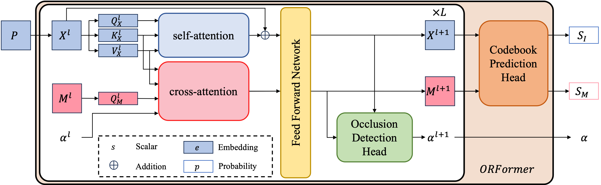
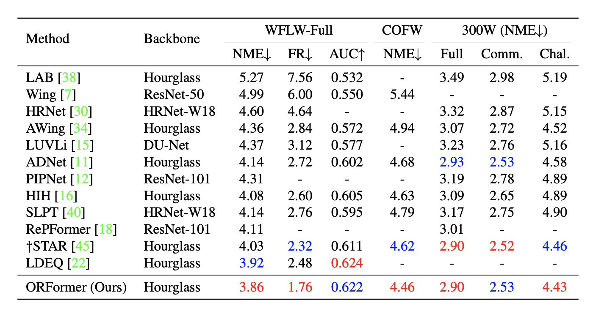

# ORFormer (WACV 2025 Oral)
This is the offcial repository of WACV 2025 Oral paper **_ORFormer: Occlusion-Robust Transformer for Accurate Facial Landmark Detection_**.

[Project Website](https://ben0919.github.io/ORFormer/)

[arxiv Paper](https://arxiv.org/abs/2412.13174)

[WACV Paper](https://openaccess.thecvf.com/content/WACV2025/papers/Chiang_ORFormer_Occlusion-Robust_Transformer_for_Accurate_Facial_Landmark_Detection_WACV_2025_paper.pdf)

## Architecture

## Quantitative Results

## Training Commands
All experiments can be run on a NVIDIA GTX1080Ti(11Gb RAM).
### Quantized Heatmap Generator
```bash
#WFLW
CUDA_VISIBLE_DEVICES=x python train_heatmap_generator.py --dataset WFLW --name [run_name] --resultDir [result_dir] --lr 0.0007 --batch_size 128 --alpha 100
#300W
CUDA_VISIBLE_DEVICES=x python train_heatmap_generator.py --dataset 300W --name [run_name] --resultDir [result_dir] --lr 0.0008 --batch_size 128 --alpha 1000
#COFW
CUDA_VISIBLE_DEVICES=x python train_heatmap_generator.py --dataset COFW --name [run_name] --resultDir [result_dir] --lr 0.0007 --batch_size 128 --alpha 100
```
### ORFormer
```bash
#WFLW
CUDA_VISIBLE_DEVICES=x python train_ORFormer.py --dataset WFLW --name [run_name] --resultDir [result_dir] --lr 0.0001 --batch_size 64 --alpha 50 --vit ORFormer
#300W
CUDA_VISIBLE_DEVICES=x python train_ORFormer.py --dataset 300W --name [run_name] --resultDir [result_dir] --lr 0.0001 --batch_size 64 --alpha 100 --vit ORFormer
#COFW
CUDA_VISIBLE_DEVICES=x python train_ORFormer.py --dataset COFW --name [run_name] --resultDir [result_dir] --lr 0.0001 --batch_size 64 --alpha 50 --vit ORFormer
```
### Integration with FLD Methods
```bash
#WFLW
CUDA_VISIBLE_DEVICES=x python train_HGNet_with_ORFormer.py --dataset WFLW --name [run_name] --resultDir [result_dir] --lr 0.001 --batch_size 16 --alpha 0.05 --heatmap ORFormer
#300W
CUDA_VISIBLE_DEVICES=x python train_HGNet_with_ORFormer.py --dataset 300W --name [run_name] --resultDir [result_dir] --lr 0.001 --batch_size 16 --alpha 0.05 --heatmap ORFormer
#COFW
CUDA_VISIBLE_DEVICES=x python train_HGNet_with_ORFormer.py --dataset COFW --name [run_name] --resultDir [result_dir] --lr 0.001 --batch_size 16 --alpha 0.05 --heatmap ORFormer
```
## Performance
||WFLW|300W|COFW|Training|Inference|
|----|----|----|----|----|----|
|Quantized Heatmap Generator|L2 Loss: 26.72|L2 Loss: 14.12|L2 Loss: 30.32|train_heatmap_generator.py|test_heatmap_generator.py|
|ORFormer|L2 Loss: 20.22|L2 Loss: 10.97|L2 Loss: 23.06|train_ORFormer.py|test_ORFormer.py|
|Integration|NME Loss: 3.86|NME Loss: 2.90|NME Loss: 4.46|train_HGNet_with_ORFormer.py|test_HGNet_with_ORFormer.py|

## Links
[Datasets](https://drive.google.com/file/d/1JmKIstIrfp0mtfTvM0cxMHyZVxYB3k_0/view?usp=share_link)

[weights](https://drive.google.com/file/d/1ebTTbJb9Hsp2bLiUsFgm7_PvtdtsPgPH/view?usp=share_link)

## Citation
```
@InProceedings{Chiang_2025_WACV,
    author    = {Chiang, Jui-Che and Hu, Hou-Ning and Hou, Bo-Syuan and Tseng, Chia-Yu and Liu, Yu-Lun and Chen, Min-Hung and Lin, Yen-Yu},
    title     = {ORFormer: Occlusion-Robust Transformer for Accurate Facial Landmark Detection},
    booktitle = {Proceedings of the Winter Conference on Applications of Computer Vision (WACV)},
    month     = {February},
    year      = {2025},
    pages     = {784-793}
}
```
## Acknowledgement
This repository is build on top of [SLPT](https://github.com/Jiahao-UTS/SLPT-master/tree/main), [ADNet](https://github.com/huangyangyu/ADNet/tree/main), [STAR](https://github.com/ZhenglinZhou/STAR/tree/master) and [vit_pytorch](https://github.com/lucidrains/vit-pytorch). Huge appreciation for the excellent codebases provided by these projects!
